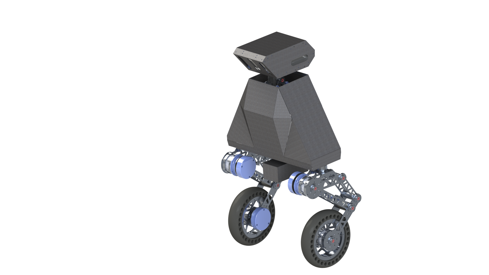
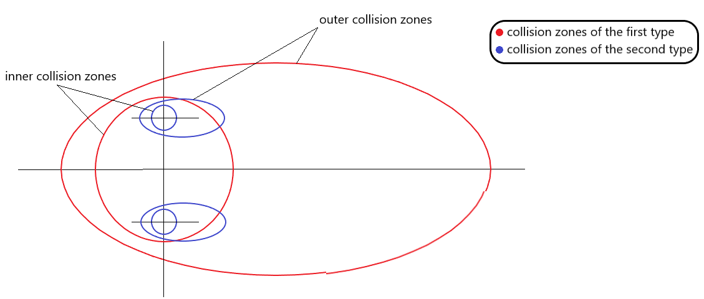

# collision-avoidance package
## Collision avoidance algorithm
This is a collision avoidance algorithm for the two-wheeled mobile robot.

<figure>
    
    <div style="text-align: center;">
        <figcaption>Two-wheeled robot</figcaption>
    </div>
</figure>

<figure>
    
    <div style="text-align: center;">
        <figcaption>Collision zones</figcaption>
    </div>
</figure>

The collision avoidance package defines inner and outer collision zones.
There are two types of the collision zones. The collision zones of the
first type are located around the robot. The collision zones of the second
type are located around the robot wheels. The collision zone of the second type
respond only on obstacle that are small enough to be passed between the
robot legs (passable). The collision zones of the first type respond only on
the big obstacles (unpassable).
The inner zone is a circle. The outer zone is an ellipse. The robot is
located in the center of the inner zone and at one of the outer zone focuses
(zones of the first type). The second focus is located on the line collinear
to the velocity vector. The robot wheels are located the same inside the
zones of the second type.
The outer zone major axis is directed along the robot velocity vector and is
proportional to the velocity value:


a - major axis;
b - minor axis;
V_x, V_y, V_z - velocity vector projection on cartesian axes;
k - proportionality coefficient.

When an obstacle gets inside the outer collision zone the robot starts to
slow down and the velocity change is proportional to the distance of the
closest obstacle point to the robot or wheel center:


d - distance of the closest obstacle point to the robot or wheel center;
r_inner - radius of the inner collision zone.


As there are three collision zone sets, these output three updated velocities.
The final updated velocity of the robot is the geometric mean of all the
output velocities:


## The collision-avoidance package
The collision-avoidance package initializes a ros node with a name
"collision_avoidance_node" that creates sets of collision zones, checks for
obstacles inside the outer collision zones and updates the robot velocity. It
can be run alone or together with another ros node.

When run separately the package works in the mode of **simulation** of the robot
movement. The node input topics are
1. "/non_passable_grid" (accepts the unpassable grid)
2. "/passable_grid" (accepts the passable grid).

The passable and unpassable grids are occupancy grids whose occupied cells
correspond to the passable and unpassable obstacles.
4. "/cmd_vel" which is the command velocity sent to the robot.

Also, the package initializes the "teleop_twist_keyboard" node that allows to
control movement of the robot by setting the velocity vector on the "/cmd_vel"
topic. So, if you don't have the teleop_twist_keyboard package you should
download it to run the collision-avoidance package in the simulation mode.

Also, the collision avoidance package can be run along with another package.
Then it **doesn't** work in simulation mode. It initializes the
"collision_avoidance_node" only. The input topics in that case are:
1. "/non_passable_grid"
2. "/passable_grid"
3. "/cmd_vel"
4. "/odom_proj" (an odometry messages topic, these messages represent the
robot position in map frame).

"collision_avoidance.launch" file runs the collision-avoidance package. Its
input arguments are:
1. "simulation" - bool argument, determines whether the package will run in
the simulation mode (default "true").
2. "output_plot" - bool argument, determines whether to display a plot of
the command and the output velocity change (default "false").

To run the collision-avoidance package in simulation mode you can launch
the collision-avoidance.launch file with default arguments via the command
"roslaunch collision-avoidance collision_avoidance.launch".

To build and/or run the collision-avoidance package:
1. go to the tmp directory:
```
cd <path to the collision-avoidance package>/tmp
```
2. change the CATKIN_WS path variable in "build_collision_avoidance.sh" and
"run_collision_avoidance_robot.sh" files.
3. To build the package write
```
./build_collision_avoidance.sh
```
4. To build and run the package write
```
./run_collision_avoidance_robot.sh
```